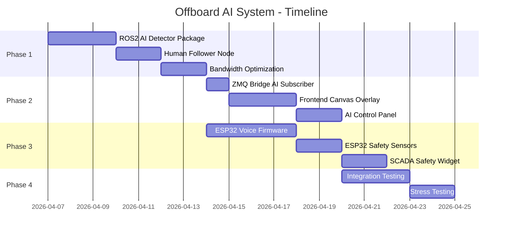

# PLAN: Offboard AI System — Object Detection, Human Tracking & Safety Sensors

> **Status:** 📋 Planning  
> **Created:** 2026-04-02  
> **Priority:** High  
> **Estimated Effort:** 3–4 weeks (part-time)

---

## 1. Tổng Quan Dự Án

### Mục Tiêu
Mở rộng hệ thống Wheeltec Mecanum Robot với khả năng:
1. **Object Detection & Human Tracking** — Nhận diện vật thể và bám theo người bằng AI (YOLOv8) chạy trên Laptop (Offboard Computing).
2. **Voice Control** — Điều khiển Robot bằng giọng nói qua ESP32-S3 (Edge AI).
3. **Safety Monitoring** — Thu thập dữ liệu cảm biến môi trường (khói, gas, lửa, bụi) và cảnh báo realtime trên SCADA Dashboard.

### Ràng Buộc Phần Cứng
- **Raspberry Pi 4** đã quá tải (ROS2 + Nav2 + ZMQ Bridge + Camera). Không thêm tác vụ AI.
- **Astra Camera** (RGB + Depth) đã được cài đặt trên Robot.
- **Laptop** có GPU (RTX 3050+) hoặc CPU mạnh sẽ đảm nhận xử lý AI.
- **ESP32-S3** (mua mới) sẽ đảm nhận Voice + Sensor.

### Kiến Trúc Tổng Thể

```
┌─────────────────────────────────────────────────────────────────────────┐
│                           WiFi Network (5GHz)                          │
└──────────┬──────────────────┬────────────────────┬──────────────────────┘
           │                  │                    │
    ┌──────▼──────┐   ┌──────▼───────┐    ┌───────▼────────┐
    │  Robot RPi  │   │   Laptop     │    │   ESP32-S3     │
    │             │   │   (AI GPU)   │    │   (Edge AI)    │
    │ • ROS2 Base │   │              │    │                │
    │ • Lidar     │   │ • YOLOv8     │    │ • ESP-SR Voice │
    │ • Astra Cam │   │ • Tracking   │    │ • MQ-2 Gas     │
    │ • Nav2      │   │ • /cmd_vel   │    │ • Flame Sensor │
    │ • ZMQ Bridge│   │              │    │ • Dust Sensor  │
    └──────┬──────┘   └──────┬───────┘    └───────┬────────┘
           │                  │                    │
           │ ZMQ (Video)      │ WebSocket          │ micro-ROS / MQTT
           ▼                  │ (JSON metadata)    ▼
    ┌──────────────┐          │             ┌──────────────┐
    │  VPS Server  │◄─────────┘             │  RPi (relay) │
    │              │                        │  or VPS API  │
    │ • FastAPI    │                        └──────────────┘
    │ • Next.js    │
    │ • Nginx+SSL  │
    │ • Canvas     │
    │   Overlay    │
    └──────────────┘
```

---

## 2. Phân Chia Phase

### Phase 1: Offboard Object Detection (Laptop ↔ ROS2)
> **Thời gian:** 1 tuần  
> **Agent:** `backend-specialist` + `ros2-humble` skill

#### Task 1.1: Tạo ROS2 Package `wheeltec_ai_detector`
- **Vị trí:** `src/wheeltec_ai_detector/`
- **Loại:** `ament_python` package
- **Node chính:** `detector_node`
- **Chức năng:**
  - Subscribe `/camera/color/image_raw/compressed` (CompressedImage)
  - Chạy YOLOv8n inference (ultralytics)
  - Publish `/ai/detections` (custom msg hoặc `vision_msgs/Detection2DArray`)
  - Publish `/ai/tracked_target` (geometry_msgs/Point — tâm mục tiêu)
  - Publish `/ai/annotated_image/compressed` (optional — hình đã vẽ khung)

#### Task 1.2: Tạo ROS2 Package `wheeltec_human_follower`
- **Vị trí:** `src/wheeltec_human_follower/`
- **Loại:** `ament_python` package
- **Node chính:** `follower_node`
- **Chức năng:**
  - Subscribe `/ai/tracked_target` + `/camera/depth/image_raw` (Astra Depth)
  - Tính khoảng cách người ↔ Robot từ Depth map
  - Publish `/cmd_vel` để Robot bám theo người
  - Tham số cấu hình: `follow_distance`, `max_speed`, `lost_timeout`

#### Task 1.3: Launch File cho Laptop
- **File:** `src/wheeltec_ai_detector/launch/offboard_ai.launch.py`
- **Nội dung:** Gộp `detector_node` + `follower_node`
- **Cách chạy trên Laptop:**
  ```bash
  # Laptop cùng mạng WiFi, cùng ROS_DOMAIN_ID
  export ROS_DOMAIN_ID=0
  ros2 launch wheeltec_ai_detector offboard_ai.launch.py
  ```

#### Task 1.4: Tối ưu băng thông Camera
- Cấu hình `image_transport` trên RPi publish compressed topic
- Chọn JPEG quality 60-70% cho cân bằng chất lượng/bandwidth
- Test với 5GHz WiFi → target ≥ 20 FPS

---

### Phase 2: SCADA Dashboard Integration (AI Overlay)
> **Thời gian:** 1 tuần  
> **Agent:** `frontend-specialist` + `backend-specialist`

#### Task 2.1: Mở rộng ZMQ Bridge gửi AI Metadata
- **File:** `src/wheeltec_scada_bridge/wheeltec_scada_bridge/node.py`
- **Thêm Subscriber:**
  - `/ai/detections` → Gộp vào `telemetry_data["detections"]`
  - Format: `[{"label": "person", "confidence": 0.92, "bbox": [x, y, w, h]}, ...]`
- **Lưu ý:** Chỉ gửi JSON metadata, KHÔNG gửi hình ảnh AI qua ZMQ

#### Task 2.2: WebSocket Handler nhận Detection Data
- **File:** `website/server/app/ws/handler.py`
- **Thêm:** Forward `detections` array trong telemetry payload tới frontend

#### Task 2.3: Frontend Canvas Overlay Component
- **File:** `website/client/src/components/scada/ai-overlay.tsx`
- **Chức năng:**
  - Nhận `detections[]` từ WebSocket telemetry
  - Vẽ Bounding Box lên `<canvas>` đè trên Camera Feed
  - Màu sắc theo label: `person` = xanh lá, `obstacle` = đỏ
  - Hiển thị confidence % và label text
  - Animation mượt: lerp (nội suy) vị trí box giữa các frame để giảm "nhảy cóc"

#### Task 2.4: AI Control Panel trên Navigation Page
- **File:** `website/client/src/app/(default)/navigation/page.tsx`
- **Thêm Section:**
  - Toggle: "Human Following Mode" ON/OFF
  - Hiển thị: Target distance, tracking status
  - Nút: "Stop Following" (gửi cmd_vel zero + disable)

---

### Phase 3: ESP32-S3 Voice Control & Safety Sensors
> **Thời gian:** 1 tuần  
> **Agent:** `backend-specialist` (embedded firmware)

#### Task 3.1: ESP32-S3 Firmware — Voice Recognition
- **Framework:** ESP-IDF + ESP-SR (Espressif Speech Recognition)
- **Chức năng:**
  - Wake word detection: "Hey Robot" (luôn lắng nghe, ~5mA idle)
  - Command recognition (offline, tiếng Anh):
    | Lệnh nói | Hành động |
    |----------|-----------|
    | "Go forward" | `cmd_vel linear_x=0.3` |
    | "Go back" | `cmd_vel linear_x=-0.3` |
    | "Turn left" | `cmd_vel angular_z=0.5` |
    | "Turn right" | `cmd_vel angular_z=-0.5` |
    | "Stop" | `cmd_vel zero` |
    | "Go home" | `nav_goal home_point` |
    | "Follow me" | Enable human follower |
  - Gửi lệnh qua: **MQTT → FastAPI** hoặc **micro-ROS Serial → RPi**

#### Task 3.2: ESP32-S3 Firmware — Safety Sensors
- **Cảm biến:**
  | Cảm biến | Chân | Ngưỡng cảnh báo |
  |----------|------|-----------------|
  | MQ-2 (Gas/Khói) | ADC GPIO4 | > 400 ppm |
  | Flame Sensor | Digital GPIO5 | LOW = Phát hiện lửa |
  | GP2Y1010AU (Bụi) | ADC GPIO6 | > 150 µg/m³ |
  | DHT22 (Nhiệt/Ẩm) | GPIO7 | > 50°C |
- **Chu kỳ đọc:** 1 lần/giây (tiết kiệm năng lượng)
- **Khi vượt ngưỡng:**
  - Phát còi buzzer trên ESP32
  - Gửi alert tới SCADA qua MQTT/API

#### Task 3.3: Chọn giao thức kết nối ESP32 ↔ Hệ thống

| Phương án | Ưu điểm | Nhược điểm | Khuyến nghị |
|-----------|---------|------------|-------------|
| **micro-ROS (USB Serial)** | Chuẩn ROS2, publish topic trực tiếp | Cần cáp USB, cấu hình phức tạp | Nếu muốn tích hợp sâu |
| **MQTT → FastAPI** | Đơn giản, WiFi không dây, dễ debug | Thêm MQTT broker (mosquitto) | ✅ Khuyến nghị cho MVP |
| **HTTP REST → FastAPI** | Đơn giản nhất | Polling, không realtime | Không phù hợp |

#### Task 3.4: SCADA Safety Dashboard Widget
- **File:** `website/client/src/components/scada/safety-monitor.tsx`
- **Chức năng:**
  - Hiển thị realtime: Gas level, Dust level, Temperature, Humidity
  - Gauge chart cho từng cảm biến
  - Alert banner đỏ khi vượt ngưỡng nguy hiểm
  - Lịch sử cảnh báo trong Event Log

---

### Phase 4: Tích Hợp & Testing
> **Thời gian:** 3-5 ngày  
> **Agent:** `debugger` + `security-auditor`

#### Task 4.1: Integration Test — Offboard AI Pipeline
- [ ] Laptop subscribe compressed image từ RPi qua WiFi 5GHz
- [ ] YOLOv8 inference ≥ 15 FPS
- [ ] Detection metadata hiển thị đúng trên SCADA Canvas
- [ ] Human Follower bám người ổn định ở khoảng cách 1m
- [ ] Latency tổng (camera → bounding box trên web) < 200ms

#### Task 4.2: Integration Test — ESP32-S3
- [ ] Wake word detection hoạt động trong bán kính 2m
- [ ] Command recognition accuracy ≥ 85%
- [ ] Gas sensor alert hiển thị trên SCADA trong < 2 giây
- [ ] Robot dừng khẩn cấp khi phát hiện lửa

#### Task 4.3: Stress Test — Multi-stream
- [ ] Chạy đồng thời: Camera stream + AI overlay + Safety telemetry
- [ ] VPS CPU usage < 30%
- [ ] Frontend smooth ≥ 20 FPS rendering
- [ ] Không memory leak sau 1 giờ chạy liên tục

---

## 3. Danh Sách Phần Cứng Cần Mua

| Linh kiện | Số lượng | Giá ước tính | Ghi chú |
|-----------|----------|-------------|---------|
| ESP32-S3-DevKitC-1 (hoặc ESP32-S3-BOX) | 1 | ~200.000đ | Có mic MEMS tích hợp nếu chọn BOX |
| INMP441 MEMS Microphone | 1 | ~30.000đ | Nếu chọn DevKitC không có mic |
| MQ-2 Gas Sensor Module | 1 | ~25.000đ | Phát hiện LPG, CO, khói |
| Flame Sensor Module | 1 | ~15.000đ | Phát hiện tia hồng ngoại lửa |
| GP2Y1010AU Dust Sensor | 1 | ~80.000đ | Đo bụi mịn PM2.5 |
| DHT22 Temp/Humidity | 1 | ~35.000đ | Nhiệt độ + độ ẩm |
| Buzzer Module 3.3V | 1 | ~10.000đ | Còi cảnh báo |
| Router WiFi 5GHz mini | 1 | ~250.000đ | Gắn trên xe, mạng nội bộ chuyên dụng |

**Tổng ước tính: ~645.000đ** (~$26 USD)

---

## 4. Cấu Trúc Thư Mục Sau Khi Hoàn Thành

```
src/
├── wheeltec_ai_detector/           # [MỚI] Phase 1 — Chạy trên Laptop
│   ├── package.xml
│   ├── setup.py
│   ├── launch/
│   │   └── offboard_ai.launch.py
│   └── wheeltec_ai_detector/
│       ├── detector_node.py        # YOLOv8 inference
│       └── follower_node.py        # Human following logic
│
├── wheeltec_scada_bridge/          # [SỬA] Phase 2 — Thêm AI subscriber
│   └── wheeltec_scada_bridge/
│       └── node.py                 # + /ai/detections subscriber
│
├── esp32_firmware/                 # [MỚI] Phase 3 — ESP-IDF project
│   ├── main/
│   │   ├── voice_control.c         # ESP-SR wake word + commands
│   │   ├── safety_sensors.c        # ADC reading + threshold alerts
│   │   └── mqtt_client.c           # MQTT publish to VPS/RPi
│   └── CMakeLists.txt
│
website/client/src/components/scada/
├── ai-overlay.tsx                  # [MỚI] Phase 2 — Canvas bounding box
├── safety-monitor.tsx              # [MỚI] Phase 3 — Gauge charts
└── ...existing components...
```

---

## 5. Rủi Ro & Giảm Thiểu

| Rủi ro | Mức độ | Giảm thiểu |
|--------|--------|------------|
| WiFi 2.4GHz gây lag camera | Cao | Dùng Router 5GHz riêng gắn trên xe |
| YOLOv8 chậm trên CPU laptop | Trung bình | Dùng model `yolov8n` (nano), hoặc chuyển sang `yolov8n-onnx` |
| ESP-SR không nhận tiếng Việt | Thấp | Dùng command tiếng Anh, hoặc train custom model |
| Lệch pha (desync) bbox và video | Thấp | Frontend lerp animation + timestamp matching |
| Cảm biến MQ-2 cần warm-up 20s | Thấp | Delay alert 30s sau khi boot |

---

## 6. Thứ Tự Ưu Tiên Triển Khai



> **Phase 1 và Phase 3 có thể chạy song song** nếu bạn đã có ESP32-S3 trong tay.
