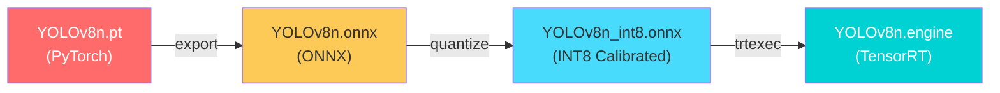

# AI Detection & Human Tracking System Plan

## 🧠 Brainstorm: Architecture Options

### Context

Xây dựng hệ thống AI: **Object Detection (YOLOv8)** + **Human Tracking** trên nền tảng phân tán:

- **Raspberry Pi 4**: Robot control (base + lidar) — chạy `turn_on_wheeltec_robot`
- **Jetson Orin Nano Super Dev Kit**: AI Layer — chạy detection + tracking
- Giao tiếp qua **DDS** (ROS2 Humble) giữa 2 board
- Target: **<50ms latency**, real-time FPS tối ưu

### Hiện trạng codebase

| Package hiện có          | Chức năng                               | Ghi chú                                                |
| ------------------------ | --------------------------------------- | ------------------------------------------------------ |
| `wheeltec_robot_kcf`     | KCF Tracker (C++)                       | Dùng HOG features, manual ROI selection, PID → cmd_vel |
| `simple_follower_ros2`   | Visual/Laser/ArUco follower (Python)    | HSV-based, không dùng DL                               |
| `turn_on_wheeltec_robot` | Base robot bringup                      | Camera launch: `wheeltec_camera.launch.py`             |
| `wheeltec_robot_msg`     | Custom msgs: `Data.msg`, `Position.msg` | Cần mở rộng cho detection                              |

> [!IMPORTANT]
> Hiện tại **không có code YOLO, ONNX, TensorRT nào trong codebase**. Đây là project hoàn toàn mới trên AI Layer.

---

### Option A: Monolithic Detection Node (Single Node Architecture)

Một node ROS2 duy nhất trên Jetson đảm nhận toàn bộ pipeline: Camera → Detection → Tracking → Publish.

```
┌─── Jetson Orin Nano ──────────────────────┐
│  ┌───────────────────────────────────┐     │
│  │  ai_detection_node (Python/C++)  │     │
│  │  ┌──────┐ ┌──────┐ ┌─────────┐  │     │
│  │  │Camera│→│YOLOv8│→│Tracker  │  │     │
│  │  │Input │ │Engine│ │ByteTrack│  │     │
│  │  └──────┘ └──────┘ └─────────┘  │     │
│  └──────────┬────────────────────────┘     │
│             │ /detections, /tracked_humans │
└─────────────┼──────────────────────────────┘
       DDS    │
┌─────────────┼──────────────────────────────┐
│  Raspberry Pi 4                            │
│  turn_on_wheeltec_robot (base + lidar)     │
│  human_follower_node → /cmd_vel            │
└────────────────────────────────────────────┘
```

✅ **Pros:**

- Đơn giản, dễ debug, ít overhead IPC
- Zero-copy giữa detection → tracking (in-process)
- Dễ quản lý lifecycle

❌ **Cons:**

- Khó scale riêng detection vs tracking
- Nếu detection crash → mất cả tracking
- Không tận dụng được composable nodes

📊 **Effort:** Low

---

### Option B: Modular Pipeline (Multi-Node, Recommended)

Tách thành các node riêng biệt, composable, giao tiếp qua shared memory.

```
┌─── Jetson Orin Nano ─────────────────────────────────────────────┐
│                                                                   │
│  ┌─────────────┐    ┌──────────────────┐    ┌─────────────────┐  │
│  │ camera_node │───→│ detection_node   │───→│ tracker_node    │  │
│  │ (usb_cam)   │img │ (YOLOv8 TRT)    │det │ (ByteTrack)     │  │
│  └─────────────┘    └──────────────────┘    └────────┬────────┘  │
│                                                       │           │
│                    /detection_results           /tracked_humans   │
│                                                       │           │
│  ┌──────────────────────────────────────────────────────────────┐ │
│  │ visualization_node (debug, optional)                         │ │
│  └──────────────────────────────────────────────────────────────┘ │
└───────────────────────────────────────┬───────────────────────────┘
                                 DDS   │
┌───────────────────────────────────────┼───────────────────────────┐
│  Raspberry Pi 4                       │                           │
│                                       ▼                           │
│  ┌─────────────────────┐    ┌───────────────────┐                │
│  │ turn_on_wheeltec_   │    │ human_follower    │                │
│  │ robot (base+lidar)  │    │ _node (PID→cmd_vel│                │
│  └─────────────────────┘    └───────────────────┘                │
└───────────────────────────────────────────────────────────────────┘
```

✅ **Pros:**

- Modular: có thể restart/upgrade detection mà không ảnh hưởng tracking
- Composable nodes: dùng intra-process communication → near zero-copy
- Dễ test từng component độc lập
- Có thể chạy visualization node riêng cho debug

❌ **Cons:**

- Complexity cao hơn Option A
- Cần quản lý QoS matching giữa các node

📊 **Effort:** Medium

---

### Option C: Component Container (Maximum Performance)

Dùng composable node container để tất cả node share memory space, tối ưu cho real-time.

```
┌─── Jetson Orin Nano ──────────────────────────────────────────────┐
│                                                                    │
│  ┌── ComponentContainer (single process) ───────────────────────┐ │
│  │                                                               │ │
│  │  [camera_component] → [detection_component] → [tracker_comp] │ │
│  │       intra-process        intra-process        intra-proc   │ │
│  │       zero-copy            zero-copy             zero-copy   │ │
│  └──────────────────────────────────────────┬────────────────────┘ │
│                                              │ /tracked_humans     │
│                                              │ (inter-process DDS) │
└──────────────────────────────────────────────┼─────────────────────┘
                                        DDS   │
┌──────────────────────────────────────────────┼─────────────────────┐
│  Raspberry Pi 4                              │                     │
│  [turn_on_wheeltec_robot] + [human_follower] ▼ → /cmd_vel          │
└────────────────────────────────────────────────────────────────────┘
```

✅ **Pros:**

- **Zero-copy** image passing giữa camera → detection → tracker
- Cực kỳ nhanh (giảm ~2-3ms latency so với Option B)
- Single process → dễ profile + debug memory

❌ **Cons:**

- Phải viết toàn bộ bằng **C++** (composable nodes yêu cầu)
- Nếu 1 component crash → cả container crash
- Effort cao nhất, khó maintain

📊 **Effort:** High

---

## 💡 Recommendation

> **Option B: Modular Pipeline** — cân bằng giữa performance và maintainability.

**Lý do:**

1. Python support cho AI (ultralytics, onnxruntime) → rapid development
2. Composable node container vẫn hỗ trợ Python nodes (rclpy) cho intra-process
3. Detection node dùng TensorRT C++ binding hoặc Python → linh hoạt
4. Dễ mở rộng thêm feature (face recognition, gesture, etc.) sau này
5. Debug/monitoring dễ dàng hơn Option C

---

## User Review Required

> [!IMPORTANT]
> **Quyết định cần xác nhận trước khi implement:**
>
> 1. **Camera type trên Jetson**: USB cam (Astra S đang dùng) hay CSI camera (IMX477, etc.)?
> 2. **YOLOv8 model size**: `yolov8n` (nano, fastest) hay `yolov8s` (small, better accuracy)?
> 3. **Human tracking algorithm**: ByteTrack (SOTA, fast) hay DeepSORT (classic, re-ID feature)?
> 4. **ROS_DOMAIN_ID**: Jetson và Raspi có cùng network? Dùng domain ID nào?
> 5. **DDS implementation**: FastDDS (default) hay CycloneDDS (recommended cho multi-machine)?

> [!WARNING]
> **Cross-platform concern**: Jetson ARM64 (aarch64) vs development PC (x86_64) — cần build riêng cho mỗi platform. TensorRT engine **KHÔNG portable** giữa các GPU khác nhau.

---

## Proposed Changes

### Jetson Orin Nano Super Dev Kit — Specs Reference

| Spec           | Value                                     |
| -------------- | ----------------------------------------- |
| GPU            | 1024-core NVIDIA Ampere (32 Tensor Cores) |
| CPU            | 8-core Arm Cortex-A78AE                   |
| RAM            | 8GB LPDDR5 (shared CPU+GPU)               |
| AI Performance | 67 TOPS (INT8)                            |
| TensorRT       | Supported (CUDA 12.x)                     |
| JetPack        | 6.x (Ubuntu 22.04 based)                  |
| Power          | 7W - 25W configurable                     |

---

### Component 1: Custom Messages Package

#### [MODIFY] [wheeltec_robot_msg](file:///home/robot/wheeltec_ros2/src/wheeltec_robot_msg)

Thêm custom message types cho detection + tracking:

**New messages:**

- `Detection2D.msg` — Single detection result (bbox, class, confidence)
- `Detection2DArray.msg` — Array of detections per frame
- `TrackedHuman.msg` — Tracked human with ID, bbox, velocity
- `TrackedHumanArray.msg` — Array of tracked humans

```
# Detection2D.msg
std_msgs/Header header
string class_name
int32 class_id
float32 confidence
float32 x_center        # normalized [0,1]
float32 y_center        # normalized [0,1]
float32 width            # normalized [0,1]
float32 height           # normalized [0,1]
int32 x_min              # pixel coordinates
int32 y_min
int32 x_max
int32 y_max
```

```
# TrackedHuman.msg
std_msgs/Header header
int32 track_id
float32 confidence
int32 x_min
int32 y_min
int32 x_max
int32 y_max
float32 velocity_x       # pixel/s
float32 velocity_y       # pixel/s
int32 age                # frames tracked
bool is_confirmed
```

---

### Component 2: AI Detection Package (Jetson)

#### [NEW] `wheeltec_robot_detection` — ROS2 Python package

```
wheeltec_robot_detection/
├── package.xml
├── setup.py
├── setup.cfg
├── resource/
├── config/
│   ├── detection_params.yaml       # model path, confidence threshold, NMS
│   └── tracker_params.yaml         # ByteTrack/DeepSORT params
├── models/
│   ├── export_onnx.py              # PT → ONNX conversion script
│   ├── calibrate_int8.py           # INT8 calibration dataset builder
│   └── build_engine.py             # ONNX → TensorRT engine builder
├── launch/
│   ├── detection.launch.py         # Detection only
│   ├── tracking.launch.py          # Detection + Tracking
│   └── full_ai_pipeline.launch.py  # Camera + Detection + Tracking + Viz
├── wheeltec_robot_detection/
│   ├── __init__.py
│   ├── detection_node.py           # YOLOv8 inference node
│   ├── tracker_node.py             # Human tracking node
│   ├── visualization_node.py       # Debug visualization (annotated frames)
│   ├── inference/
│   │   ├── __init__.py
│   │   ├── base_detector.py        # Abstract detector interface
│   │   ├── onnx_detector.py        # ONNX Runtime detector (CPU/GPU)
│   │   ├── tensorrt_detector.py    # TensorRT detector (Jetson GPU)
│   │   └── preprocessor.py         # Image preprocessing (resize, normalize, letterbox)
│   ├── tracking/
│   │   ├── __init__.py
│   │   ├── byte_tracker.py         # ByteTrack implementation
│   │   └── kalman_filter.py        # Kalman filter for motion prediction
│   └── utils/
│       ├── __init__.py
│       ├── nms.py                  # Non-Maximum Suppression
│       └── profiler.py             # Latency profiler
└── test/
    ├── test_detection.py
    ├── test_tracker.py
    └── test_inference.py
```

---

### Component 3: Human Follower Package (Raspberry Pi 4)

#### [NEW] `wheeltec_human_follower` — ROS2 Python package

Chạy trên Raspi 4, subscribe `/tracked_humans` từ Jetson qua DDS, tính toán PID → `/cmd_vel`.

```
wheeltec_human_follower/
├── package.xml
├── setup.py
├── setup.cfg
├── config/
│   └── follower_params.yaml        # PID gains, distance target, speed limits
├── launch/
│   └── human_follower.launch.py
├── wheeltec_human_follower/
│   ├── __init__.py
│   ├── follower_node.py            # Main follower logic
│   └── pid_controller.py           # PID controller (reuse pattern from KCF)
└── test/
    └── test_follower.py
```

---

### Component 4: Model Pipeline (PT → ONNX → TensorRT INT8)

#### Pipeline Flow



#### Step 1: PT → ONNX Export

```python
# models/export_onnx.py
from ultralytics import YOLO

model = YOLO("yolov8n.pt")
model.export(
    format="onnx",
    imgsz=640,
    opset=17,            # TensorRT compatibility
    simplify=True,       # ONNX simplifier
    dynamic=False,       # Fixed input size for TensorRT
    half=False,          # FP32 ONNX (TRT will handle INT8)
)
```

#### Step 2: INT8 Calibration

```python
# models/calibrate_int8.py
# Collect calibration dataset (500-1000 representative images)
# Run TensorRT calibrator with IInt8EntropyCalibrator2
```

#### Step 3: Build TensorRT Engine

```bash
# On Jetson Orin Nano (MUST build on target device!)
trtexec \
    --onnx=yolov8n.onnx \
    --saveEngine=yolov8n_int8.engine \
    --int8 \
    --calib=calibration_cache.bin \
    --workspace=4096 \
    --inputIOFormats=fp16:chw \
    --outputIOFormats=fp16:chw \
    --useDLACore=0 \           # Use DLA if available
    --allowGPUFallback \
    --fp16 \                    # Mixed precision INT8+FP16
    --verbose
```

#### Expected Performance (Jetson Orin Nano Super)

| Model   | Precision | Input Size  | FPS (est.) | Latency (est.) |
| ------- | --------- | ----------- | ---------- | -------------- |
| YOLOv8n | FP32      | 640×640     | ~45        | ~22ms          |
| YOLOv8n | FP16      | 640×640     | ~90        | ~11ms          |
| YOLOv8n | **INT8**  | **640×640** | **~130**   | **~8ms**       |
| YOLOv8s | FP32      | 640×640     | ~25        | ~40ms          |
| YOLOv8s | INT8      | 640×640     | ~70        | ~14ms          |

> [!TIP]
> Với INT8, tổng pipeline (camera grab + preprocess + inference + postprocess + tracking) ước tính **~25-35ms**, đáp ứng target **<50ms**.

---

### Component 5: ROS2 Topic Architecture

```
┌──────────────────────────────────────────────────────────────────────┐
│                        ROS2 Topic Map                                │
│                                                                      │
│  Jetson Orin Nano                                                    │
│  ┌─────────────────────────────────────────────────────────────────┐ │
│  │                                                                 │ │
│  │  /camera/image_raw ──→ detection_node ──→ /detection_results   │ │
│  │       (sensor_msgs/Image)        (Detection2DArray)             │ │
│  │                                                                 │ │
│  │  /detection_results ──→ tracker_node ──→ /tracked_humans       │ │
│  │       (Detection2DArray)          (TrackedHumanArray)           │ │
│  │                                                                 │ │
│  │  /tracked_humans ──→ visualization_node ──→ /annotated_image   │ │
│  │                                              (sensor_msgs/Image)│ │
│  │                                                                 │ │
│  │  /ai/diagnostics (diagnostic_msgs/DiagnosticArray)              │ │
│  │  /ai/latency (std_msgs/Float32) — inference time monitoring     │ │
│  └─────────────────────────────────────────────────────────────────┘ │
│                                                                      │
│  ═══════════════════ DDS (cross-machine) ════════════════════════    │
│                                                                      │
│  Raspberry Pi 4                                                      │
│  ┌─────────────────────────────────────────────────────────────────┐ │
│  │                                                                 │ │
│  │  /tracked_humans ──→ human_follower_node ──→ /cmd_vel          │ │
│  │       (TrackedHumanArray)              (geometry_msgs/Twist)    │ │
│  │                                                                 │ │
│  │  /scan (sensor_msgs/LaserScan) — obstacle avoidance            │ │
│  │  /odom (nav_msgs/Odometry)                                      │ │
│  └─────────────────────────────────────────────────────────────────┘ │
└──────────────────────────────────────────────────────────────────────┘
```

#### QoS Profiles

| Topic                | Reliability | Durability | History   | Depth | Why                      |
| -------------------- | ----------- | ---------- | --------- | ----- | ------------------------ |
| `/camera/image_raw`  | Best Effort | Volatile   | Keep Last | 1     | High bandwidth, drop OK  |
| `/detection_results` | Best Effort | Volatile   | Keep Last | 5     | Fast updates             |
| `/tracked_humans`    | Reliable    | Volatile   | Keep Last | 10    | **Critical for control** |
| `/cmd_vel`           | Reliable    | Volatile   | Keep Last | 1     | Safety critical          |
| `/ai/latency`        | Best Effort | Volatile   | Keep Last | 1     | Monitoring               |

---

### Component 6: DDS Multi-Machine Setup

#### Network Configuration

```yaml
# Cả Jetson và Raspi cần cùng:
# 1. ROS_DOMAIN_ID (e.g., 42)
# 2. Cùng subnet (e.g., 192.168.1.x)
# 3. CycloneDDS recommended

# /etc/cyclonedds/cyclonedds.xml (cả 2 máy)
<?xml version="1.0" encoding="UTF-8"?>
<CycloneDDS xmlns="https://cdds.io/config">
<Domain>
<General>
<Interfaces>
<NetworkInterface name="eth0" priority="default" multicast="true"/>
</Interfaces>
</General>
<Discovery>
<ParticipantIndex>auto</ParticipantIndex>
</Discovery>
</Domain>
</CycloneDDS>
```

```bash
# .bashrc trên cả 2 máy
export ROS_DOMAIN_ID=42
export RMW_IMPLEMENTATION=rmw_cyclonedds_cpp
export CYCLONEDDS_URI=file:///etc/cyclonedds/cyclonedds.xml
```

---

## Task Breakdown

### Phase 1: Foundation (No Code — Setup & Research)

| ID   | Task                                                       | Agent                | Priority | Dependencies |
| ---- | ---------------------------------------------------------- | -------------------- | -------- | ------------ |
| T1.1 | Setup CycloneDDS trên Jetson + Raspi, verify DDS discovery | `backend-specialist` | P0       | None         |
| T1.2 | Install JetPack 6.x, CUDA, TensorRT, cuDNN trên Jetson     | `backend-specialist` | P0       | None         |
| T1.3 | Verify camera driver trên Jetson (usb_cam hoặc CSI)        | `backend-specialist` | P0       | T1.2         |
| T1.4 | Download + test YOLOv8n.pt baseline trên Jetson            | `ai-engineering`     | P0       | T1.2         |

### Phase 2: Model Pipeline (PT → ONNX → TensorRT)

| ID   | Task                                                   | Agent            | Priority | Dependencies |
| ---- | ------------------------------------------------------ | ---------------- | -------- | ------------ |
| T2.1 | Create `export_onnx.py` — export YOLOv8n.pt → ONNX     | `ai-engineering` | P1       | T1.4         |
| T2.2 | Validate ONNX model (onnxruntime inference test)       | `ai-engineering` | P1       | T2.1         |
| T2.3 | Create `calibrate_int8.py` — INT8 calibration dataset  | `ai-engineering` | P1       | T2.2         |
| T2.4 | Create `build_engine.py` — ONNX → TensorRT INT8 engine | `ai-engineering` | P1       | T2.3         |
| T2.5 | Benchmark: FP32 vs FP16 vs INT8 (FPS, latency, mAP)    | `ai-engineering` | P1       | T2.4         |

### Phase 3: ROS2 Package Development

| ID    | Task                                                     | Agent            | Priority | Dependencies |
| ----- | -------------------------------------------------------- | ---------------- | -------- | ------------ |
| T3.1  | Create custom messages (Detection2D, TrackedHuman, etc.) | `ros2-humble`    | P1       | None         |
| T3.2  | Create `wheeltec_robot_detection` package skeleton       | `ros2-humble`    | P1       | T3.1         |
| T3.3  | Implement `base_detector.py` (abstract interface)        | `ai-engineering` | P1       | T3.2         |
| T3.4  | Implement `onnx_detector.py` (CPU/GPU fallback)          | `ai-engineering` | P1       | T3.3, T2.2   |
| T3.5  | Implement `tensorrt_detector.py` (Jetson optimized)      | `ai-engineering` | P1       | T3.3, T2.4   |
| T3.6  | Implement `detection_node.py` (ROS2 node)                | `ros2-humble`    | P2       | T3.4, T3.5   |
| T3.7  | Implement `byte_tracker.py` (ByteTrack algorithm)        | `ai-engineering` | P2       | T3.1         |
| T3.8  | Implement `tracker_node.py` (ROS2 tracking node)         | `ros2-humble`    | P2       | T3.6, T3.7   |
| T3.9  | Implement `visualization_node.py` (debug overlay)        | `ros2-humble`    | P3       | T3.8         |
| T3.10 | Create launch files (detection, tracking, full pipeline) | `ros2-humble`    | P2       | T3.8         |

### Phase 4: Human Follower (Raspberry Pi 4)

| ID   | Task                                                              | Agent         | Priority | Dependencies |
| ---- | ----------------------------------------------------------------- | ------------- | -------- | ------------ |
| T4.1 | Create `wheeltec_human_follower` package                          | `ros2-humble` | P2       | T3.1         |
| T4.2 | Implement `pid_controller.py` (based on KCF pattern)              | `ros2-humble` | P2       | T4.1         |
| T4.3 | Implement `follower_node.py` (subscribe tracked_humans → cmd_vel) | `ros2-humble` | P2       | T4.2, T3.8   |
| T4.4 | Create launch file + config YAML                                  | `ros2-humble` | P2       | T4.3         |

### Phase 5: Integration & Optimization

| ID   | Task                                                        | Agent            | Priority | Dependencies |
| ---- | ----------------------------------------------------------- | ---------------- | -------- | ------------ |
| T5.1 | End-to-end test: Jetson → DDS → Raspi → robot moves         | All              | P1       | T3.10, T4.4  |
| T5.2 | Latency profiling (camera → detection → tracking → cmd_vel) | `ai-engineering` | P1       | T5.1         |
| T5.3 | Optimize preprocessing (CUDA letterbox, GPU resize)         | `ai-engineering` | P2       | T5.2         |
| T5.4 | DDS bandwidth optimization (chỉ gửi bbox, không gửi image)  | `ros2-humble`    | P2       | T5.2         |
| T5.5 | Safety: obstacle avoidance integration với lidar            | `ros2-humble`    | P3       | T5.1         |

---

## Tech Stack

| Component            | Technology                                    | Rationale                               |
| -------------------- | --------------------------------------------- | --------------------------------------- |
| **Framework**        | ROS2 Humble                                   | Existing robot stack                    |
| **DDS**              | CycloneDDS                                    | Better multi-machine support vs FastDDS |
| **Detection**        | YOLOv8n (Ultralytics)                         | Best speed/accuracy for edge            |
| **Model Runtime**    | TensorRT 8.x (INT8)                           | Native Jetson optimization, 67 TOPS     |
| **Fallback Runtime** | ONNX Runtime                                  | CPU/GPU portable fallback               |
| **Tracking**         | ByteTrack                                     | SOTA MOT, fast, no re-ID needed         |
| **Image Processing** | OpenCV + CUDA                                 | GPU-accelerated preprocessing           |
| **Language**         | Python (nodes) + C++ (optional perf-critical) | Rapid development + AI library support  |
| **Calibration**      | TensorRT IInt8EntropyCalibrator2              | Best INT8 calibration for detection     |

---

## Open Questions

> [!IMPORTANT]
>
> 1. **Camera trên Jetson là loại gì?** USB cam (giống Raspi, dùng `usb_cam` package) hay CSI camera (cần `v4l2_camera` hoặc `jetson-utils`)?
> 2. **Input resolution target?** 640×640 (standard YOLO) hay 320×320 (ultra-fast, lower accuracy)?
> 3. **Tracking target chỉ human hay multi-class?** (car, bicycle, etc.)
> 4. **Network topology**: Jetson và Raspi kết nối qua Ethernet trực tiếp hay qua router WiFi?
> 5. **YOLOv8 model**: Dùng pretrained COCO (80 classes) hay cần custom training?
> 6. **Power mode Jetson**: Dùng 25W (max performance) hay 15W (balanced)?

---

## Verification Plan

### Automated Tests

```bash
# Unit tests
cd ~/wheeltec_ros2
colcon build --packages-select wheeltec_robot_msg wheeltec_robot_detection wheeltec_human_follower
colcon test --packages-select wheeltec_robot_detection wheeltec_human_follower

# Integration test: detection node
ros2 launch wheeltec_robot_detection detection.launch.py &
ros2 topic echo /detection_results --once

# Integration test: tracking
ros2 launch wheeltec_robot_detection tracking.launch.py &
ros2 topic echo /tracked_humans --once

# Latency benchmark
ros2 topic hz /tracked_humans          # Expect: 30+ Hz
ros2 topic delay /tracked_humans       # Expect: <50ms
```

### Manual Verification

1. **Model accuracy**: Run YOLOv8 INT8 engine trên test images, compare mAP vs FP32
2. **Real-time demo**: Robot follow human qua phòng, verify smooth tracking
3. **DDS health**: `ros2 node list` trên cả 2 máy, verify discovery
4. **Safety**: Robot dừng khi mất tracking target > 2 giây
5. **Latency**: End-to-end measurement < 50ms

### Performance Metrics Target

| Metric            | Target     | Measurement                        |
| ----------------- | ---------- | ---------------------------------- |
| Detection FPS     | ≥ 30 FPS   | `ros2 topic hz /detection_results` |
| E2E Latency       | < 50ms     | Custom profiler node               |
| Tracking accuracy | MOTA > 60% | Offline evaluation                 |
| DDS round-trip    | < 10ms     | `ros2 topic delay`                 |
| GPU utilization   | < 70%      | `tegrastats`                       |
| RAM usage         | < 4GB      | `tegrastats`                       |

---

## Phase X: Final Verification Checklist

- [ ] CycloneDDS discovery works between Jetson ↔ Raspi
- [ ] YOLOv8n INT8 engine built successfully on Jetson
- [ ] Detection FPS ≥ 30 on Jetson
- [ ] E2E latency < 50ms (camera → cmd_vel)
- [ ] Human tracking maintains ID across 100+ frames
- [ ] Robot follows human smoothly at target distance
- [ ] Safety stop when target lost
- [ ] `colcon test` passes all unit tests
- [ ] `colcon build` no errors/warnings
